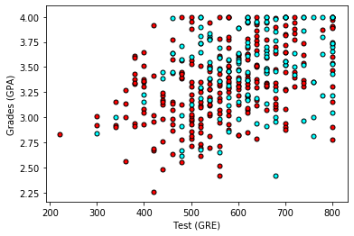

## Predicting students admissions

In this notebook, a simple neural network implementation is done to predict student admissions to graduate school at UCLA based on three pieces of data:

* GRE Scores (Test)
* GPA Scores (Grades)
* Class rank (1-4)

### Data

The dataset originally came from here: http://www.ats.ucla.edu/. The small dataset has total 400 entries, each having 4 columns: admit, gre, gpa, rank.
